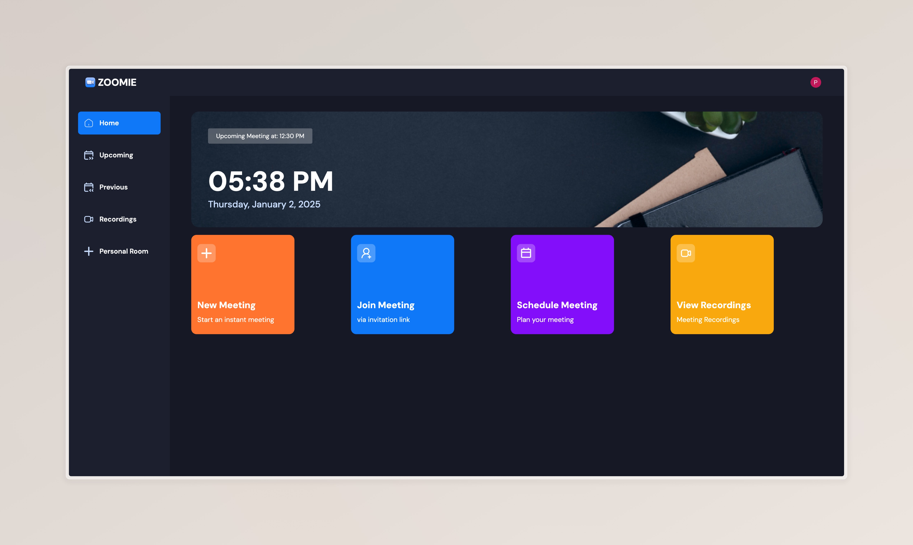
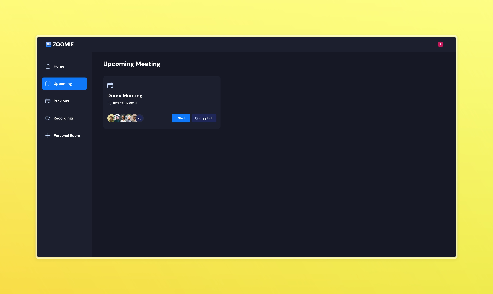
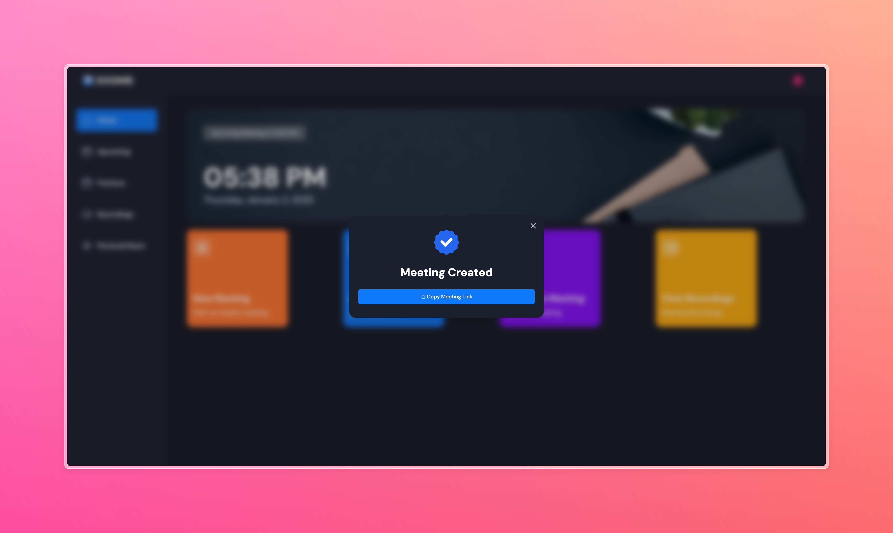
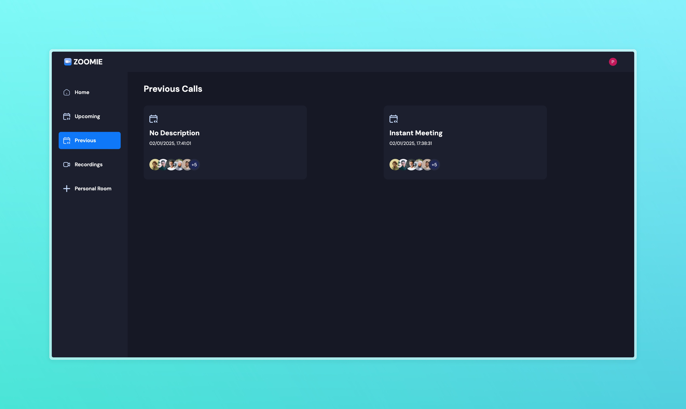

# 📹 Zoomie - Video Conferencing Platform



A modern video conferencing application built with Next.js 14, Stream Video SDK, and Clerk Authentication.




## 🌟 Features

- 🔐 Secure Authentication with Clerk
- 📹 Real-time Video Conferencing
- 💬 Live Chat During Meetings
- 📅 Meeting Scheduling
- 🎨 Modern UI with Tailwind CSS
- 🌓 Light/Dark Mode Support
- 📱 Responsive Design
- 🔗 Shareable Meeting Links



## 🛠️ Tech Stack

- **Framework:** Next.js 14
- **Authentication:** Clerk
- **Video SDK:** Stream
- **Styling:** Tailwind CSS
- **UI Components:** 
  - Radix UI
  - Lucide React Icons
- **Date Handling:** date-fns
- **Type Checking:** TypeScript
- **Video Conferencing:** getstream.io

## 📦 Installation

1. Clone the repository:
```bash
git clone https://github.com/your-repo/zoomie-zoom-clone.git
cd zoomie-zoom-clone
```

2. Install dependencies:
```bash
npm install
```

3. Create a `.env` file in the root directory with the following variables:
```bash
NEXT_PUBLIC_CLERK_PUBLISHABLE_KEY=
CLERK_SECRET_KEY=
NEXT_PUBLIC_CLERK_SIGN_IN_URL=
NEXT_PUBLIC_CLERK_SIGN_UP_URL=

NEXT_PUBLIC_CLERK_AFTER_SIGN_IN_URL=
NEXT_PUBLIC_CLERK_AFTER_SIGN_UP_URL=

STREAM_API_KEY=
STREAM_API_SECRET=
```

4. Run the development server:
```bash
npm run dev
```

5. Open [http://localhost:3000](http://localhost:3000) in your browser.



## 🚀 Deployment

The application can be deployed using [Vercel](https://vercel.com):

```bash
npm run build
```

## 📝 License

This project is licensed under the MIT License.

## 🙏 Credits

This project was built following the tutorial by [JavaScript Mastery](https://www.youtube.com/@javascriptmastery). Special thanks to Adrian Hajdin for the excellent tutorial and guidance.

- Tutorial Link: [Build and Deploy a Modern Full Stack Video Conferencing App](https://www.youtube.com/watch?v=R8CIO1DZ2b8)
- JavaScript Mastery YouTube Channel: [@javascriptmastery](https://www.youtube.com/@javascriptmastery)

## 🤝 Contributing

Contributions, issues, and feature requests are welcome! Feel free to check the [issues page](https://github.com/pakagronglb/zoomie-zoom-clone/issues).

## 📧 Contact

Project Link: [https://github.com/pakagronglb/zoomie-zoom-clone](https://github.com/pakagronglb/zoomie-zoom-clone)


